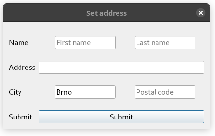

# DuGUI
A façade over Qt Widgets (and possibly other libraries) allowing to create GUIs in C++ with minimal amount code. It's not particularly efficient and requires C++17.

Although it works, it's still an alpha that can be used only to create very basic UIs. And currently only above Qt.

## Basic usage
It's indented to need minimal code, requiring writing only the absolutely necessary information:
```C++
using namespace DuGUI
struct NameWindow : Formulaire {
	Title t = title("Set address");
	struct : HBox {
		Input<std::string> first = placeholderText("First name");
		Input<std::string> last = placeholderText("Last name");
	} name = {{ noBorder().title("Name") }};
	Input<std::string> address = title("Address");
	struct : HBox {
		Input<std::string> city = placeholderText("City").defaultValue("Brno");
		Input<int> code = placeholderText("Postal code");
	} city = {{ noBorder().title("City") }};
	Button submit = title("Submit");
};
```

It communicates through an interface class that can use any GUI library. I have implemented only a wrapper above Qt so far.
```C++
	QApplication a(argc, argv);

	DuGUI::BackendQt backend;
	NameWindow window;
	window.run(backend);
```
The `run()` method blocks the thread until the window is closed.

The code above produces this window:



## Callbacks

Callbacks can be set in the GUI class too, but also from outside if it's public.
```C++
	window.submit = [&window] {
		std::string together = *window.name.first + " " + *window.name.last +
			*window.address + ", " + std::to_string(*window.city.code) + " " + *window.city.city;
		std::cout << together << std::endl;
		window.close();
	};
```
  
Methods and lambdas can be bound right in the class.
```C++
struct Setter : Formulaire {
	Title t = title("Stuff");
	Input<int> value = title("Value");
	struct: HBox {
		Button less = title("Less").reaction([this] {
			static_cast<Setter*>(parent())->value = *static_cast<Setter*>(parent())->value - 1;
		});
		Button more = title("More").reaction(&Setter::increase);
	} manipulation = {{ noBorder().title("Manipulation") }};
	void increase() {
		value = *value + 1;
	}
	Button submit = title("Done").reaction([this] {
		close();
	});
};
```
Only the main window class' methods can be bound through member function pointers. If a contained class' member function's pointer is somehow obtained, it will result it hard to debug errors (possibly also segmentation faults).

## Compiling quickly
The backend class (`DuGUI::BackendQt`) depends on Qt, but it's only an implementation of the `DuGUI::Backend` interface that depends only on some basic standard libraries. Passing it through a program as `DuGUI::Backend*` will remove nearly all dependencies and signifiantly quicken compilation.
